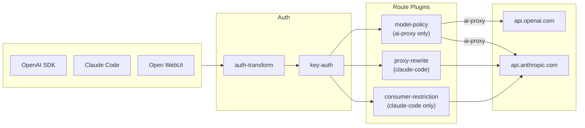
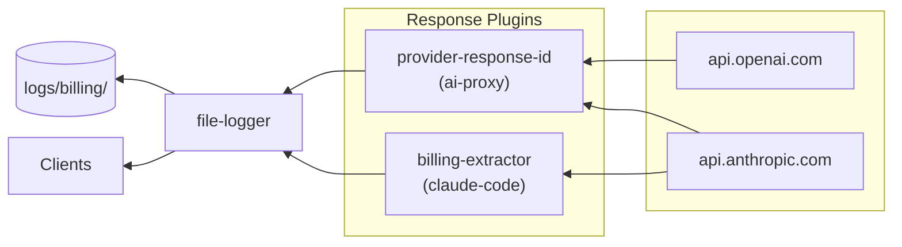
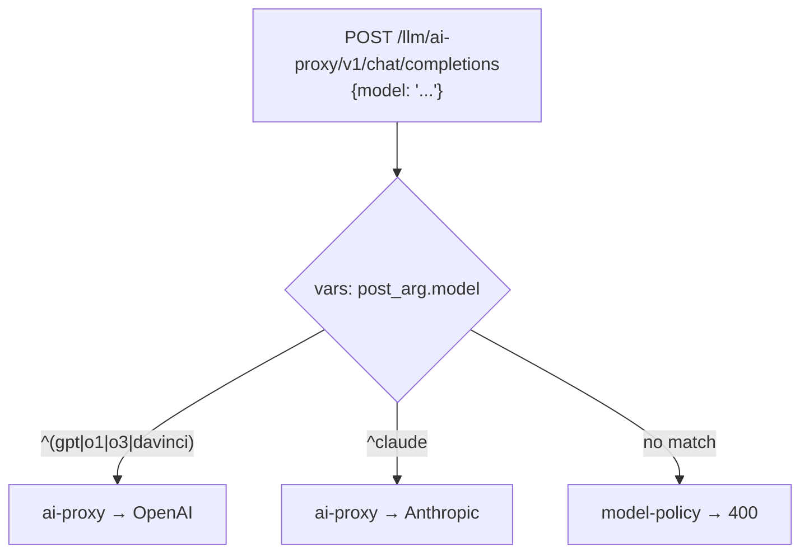

# Gateway Diagrams

## Request Flow

```mermaid
---
config:
  flowchart:
    nodeSpacing: 20
    rankSpacing: 40
---
flowchart LR
    subgraph Clients[" "]
        direction TB
        SDK[OpenAI SDK]
        CC[Claude Code]
        WebUI[Open WebUI]
    end

    subgraph Auth["Auth"]
        direction TB
        AT[auth-transform]
        KA[key-auth]
    end

    subgraph Routes["Route Plugins"]
        direction TB
        MP["model-policy<br/>(ai-proxy only)"]
        PR["proxy-rewrite<br/>(claude-code)"]
        CR["consumer-restriction<br/>(claude-code only)"]
    end

    subgraph Upstreams[" "]
        direction TB
        OAI[api.openai.com]
        ANT[api.anthropic.com]
    end

    Clients --> AT --> KA
    KA --> MP & PR & CR
    MP -->|"ai-proxy"| OAI & ANT
    PR --> ANT
    CR --> ANT
```

## Response Flow

```mermaid
---
config:
  flowchart:
    nodeSpacing: 20
    rankSpacing: 40
---
flowchart RL
    subgraph Upstreams[" "]
        direction TB
        OAI[api.openai.com]
        ANT[api.anthropic.com]
    end

    subgraph Resp["Response Plugins"]
        direction TB
        PRID["provider-response-id<br/>(ai-proxy)"]
        BE["billing-extractor<br/>(claude-code)"]
    end

    FL[file-logger]
    LOGS[("logs/billing/")]
    Clients["Clients"]

    OAI & ANT --> PRID
    ANT --> BE
    PRID & BE --> FL --> LOGS
    FL --> Clients
```

## Model Routing (ai-proxy)

```mermaid
flowchart TD
    REQ["POST /llm/ai-proxy/v1/chat/completions<br/>{model: '...'}"]

    REQ --> MATCH{vars: post_arg.model}

    MATCH -->|"^(gpt|o1|o3|davinci)"| OPENAI[ai-proxy → OpenAI]
    MATCH -->|"^claude"| ANTHROPIC[ai-proxy → Anthropic]
    MATCH -->|no match| REJECT[model-policy → 400]
```
