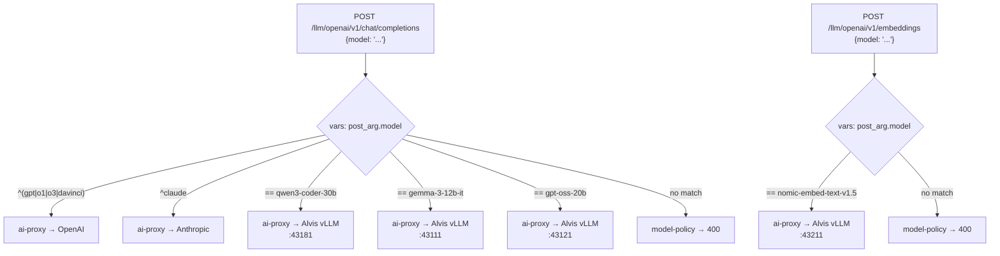

# Model Routing (OpenAI protocol)

```mermaid
flowchart TD
    REQ["POST /llm/openai/v1/chat/completions<br/>{model: '...'}"]

    REQ --> MATCH{vars: post_arg.model}

    MATCH -->|"^(gpt|o1|o3|davinci)"| OPENAI[ai-proxy → OpenAI]
    MATCH -->|"^claude"| ANTHROPIC[ai-proxy → Anthropic]
    MATCH -->|"== qwen3-coder-30b"| VLLM1["ai-proxy → Alvis vLLM<br/>:43181"]
    MATCH -->|"== gemma-3-12b-it"| VLLM2["ai-proxy → Alvis vLLM<br/>:43111"]
    MATCH -->|"== gpt-oss-20b"| VLLM3["ai-proxy → Alvis vLLM<br/>:43121"]
    MATCH -->|no match| REJECT[model-policy → 400]

    EMBED["POST /llm/openai/v1/embeddings<br/>{model: '...'}"]
    EMBED --> EMATCH{vars: post_arg.model}
    EMATCH -->|"== nomic-embed-text-v1.5"| VLLM4["ai-proxy → Alvis vLLM<br/>:43211"]
    EMATCH -->|no match| EREJECT[model-policy → 400]
```
