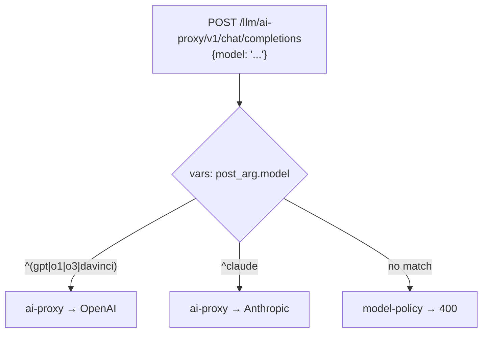

# Model Routing (ai-proxy)

```mermaid
flowchart TD
    REQ["POST /llm/ai-proxy/v1/chat/completions<br/>{model: '...'}"]

    REQ --> MATCH{vars: post_arg.model}

    MATCH -->|"^(gpt|o1|o3|davinci)"| OPENAI[ai-proxy → OpenAI]
    MATCH -->|"^claude"| ANTHROPIC[ai-proxy → Anthropic]
    MATCH -->|no match| REJECT[model-policy → 400]
```
