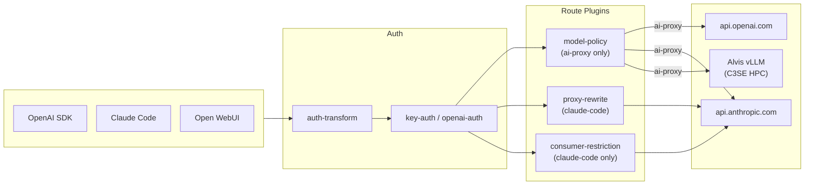

# Request Flow

```mermaid
---
config:
  flowchart:
    nodeSpacing: 20
    rankSpacing: 40
---
flowchart LR
    subgraph Clients[" "]
        direction TB
        SDK[OpenAI SDK]
        CC[Claude Code]
        WebUI[Open WebUI]
    end

    subgraph Auth["Auth"]
        direction TB
        AT[auth-transform]
        KA[key-auth / openai-auth]
    end

    subgraph Routes["Route Plugins"]
        direction TB
        MP["model-policy<br/>(ai-proxy only)"]
        PR["proxy-rewrite<br/>(claude-code)"]
        CR["consumer-restriction<br/>(claude-code only)"]
    end

    subgraph Upstreams[" "]
        direction TB
        OAI[api.openai.com]
        ANT[api.anthropic.com]
        VLLM["Alvis vLLM<br/>(C3SE HPC)"]
    end

    Clients --> AT --> KA
    KA --> MP & PR & CR
    MP -->|"ai-proxy"| OAI & ANT & VLLM
    PR --> ANT
    CR --> ANT
```
