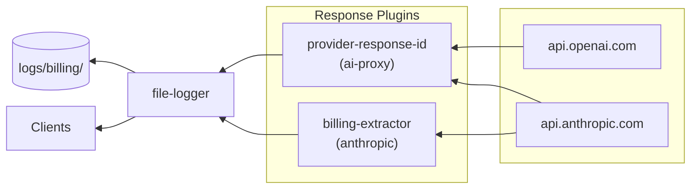

# Response Flow

```mermaid
---
config:
  flowchart:
    nodeSpacing: 20
    rankSpacing: 40
---
flowchart RL
    subgraph Upstreams[" "]
        direction TB
        OAI[api.openai.com]
        ANT[api.anthropic.com]
    end

    subgraph Resp["Response Plugins"]
        direction TB
        PRID["provider-response-id<br/>(ai-proxy)"]
        BE["billing-extractor<br/>(anthropic)"]
    end

    FL[file-logger]
    LOGS[("logs/billing/")]
    Clients["Clients"]

    OAI & ANT --> PRID
    ANT --> BE
    PRID & BE --> FL --> LOGS
    FL --> Clients
```
